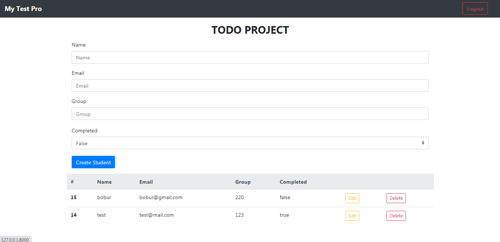

# simple-django-todo-02
TODO Django Project with JSON, REST API, No Auth

# Installation
git clone https://github.com/xarick/simple-django-todo-02.git

cd ./simple-django-todo-02

pip install -r requirements.txt

setting up your database

if you want mysql or postgresql, I used sqlite3

then

$ python manage.py migrate

$ python manage.py makemigrations

$ python manage.py runserver

# Screenshots

